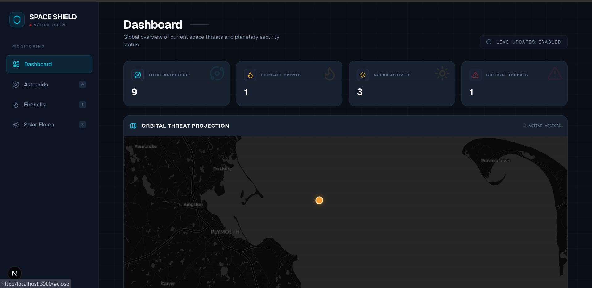

# spaceShield

SpaceShield is a real-time space intelligence platform designed to monitor and analyze near-Earth space events such as asteroids, solar flares, and meteor activity. It provides simplified explanations and risk assessments for global users.

## Demo



## Quick Start

Get SpaceShield running in a few steps:

1. **Clone the Repository:**

    ```bash
    git clone https://github.com/goal651/spaceShield.git
    cd spaceShield
    ```

2. **Start the Backend Services (with Docker Compose):**

    ```bash
    cd server
    docker compose up --build -d
    cd ..
    ```

3. **Start the Frontend Application:**

    ```bash
    cd frontend
    pnpm install
    pnpm dev
    cd ..
    ```

4. **Access the Application:** Open your web browser and go to `http://localhost:3000`.

## Features

* **Real-time Space Event Monitoring:** Track near-Earth objects like asteroids, solar flares, and meteor activity.
* **Interactive Sky Map:** Visualize space events on a dynamic map powered by Leaflet.
* **Risk Assessment:** Provides simplified explanations and risk assessments for observed events.
* **Event Notifications:** Offers real-time updates or notifications on critical events via Kafka.
* **User-Friendly Interface:** Modern and responsive web application built with Next.js and React.
* **Robust Backend:** Built with Spring Boot, Java 21, and PostgreSQL for scalable data handling.
* **Containerized Deployment:** Docker and Docker Compose for easy setup and deployment.

## How to Run It Locally

To run SpaceShield on your local machine, follow these steps.

**Prerequisites:**

* **Java 21 or higher:** (Required for Spring Boot backend)
* **Node.js (LTS recommended):** (Required for Next.js frontend)
* **pnpm:** (Recommended package manager for frontend, install with `npm install -g pnpm`)
* **Maven:** (Required for Spring Boot backend)
* **Docker & Docker Compose:** (For database, Kafka, and easier backend setup)

**1. Clone the Repository:**

```bash
git clone https://github.com/goal651/spaceShield.git
cd spaceShield
```

**2. Backend Setup (Spring Boot):**

Navigate to the `server` directory.

```bash
cd server
```

* **Start Database and Kafka with Docker Compose:**

    ```bash
    docker compose up -d
    ```

* **Build and Run the Spring Boot Application:**

    ```bash
    ./mvnw clean install
    ./mvnw spring-boot:run
    ```

    The backend will be running on `http://localhost:8080`.

* **Access API Documentation:**
    Once the backend is running, you can access the OpenAPI (Swagger UI) documentation at `http://localhost:8080/swagger-ui.html`.

**3. Frontend Setup (Next.js):**

Open a new terminal, navigate back to the main project directory `spaceShield/spaceShield`, then enter the `frontend` directory.

```bash
cd ../frontend
```

* **Install Dependencies:**

    ```bash
    pnpm install
    ```

* **Run the Development Server:**

    ```bash
    pnpm dev
    ```

    The frontend application will be available at `http://localhost:3000`.

## How It Works

SpaceShield is a full-stack application built with a modern technology stack.

* **Frontend:** Developed using **Next.js 16**, **React 19**, and styled with **Tailwind CSS**. It provides a responsive user interface for visualizing space events on an interactive map using **Leaflet**.
* **Backend:** A robust **Spring Boot (Java 21)** application that handles data processing, real-time event ingestion (via **Apache Kafka**), and API endpoints. Data is persisted in a **PostgreSQL** database.
* **Data Flow:** Real-time space event data is consumed by the Spring Boot backend (potentially via Kafka), processed, stored in PostgreSQL, and then exposed via REST APIs to the Next.js frontend for visualization and risk assessment.
* **Containerization:** Both the frontend and backend services (PostgreSQL, Kafka) are designed for Docker, with a `compose.yml` file facilitating easy orchestration of the backend environment.

## Credits / Acknowledgements

* **Developers:** Wilson Goal
* **Libraries:**
  * **Leaflet**
  * **Spring Boot**
  * **Next.js**
  * **Apache Kafka**
  * **PostgreSQL**
